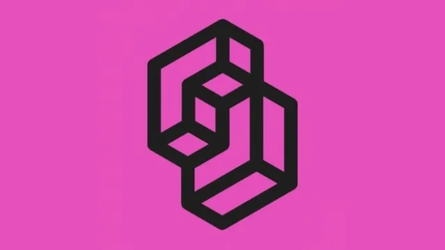

<p align="left">
  
</p>

# Jev voice prototyper

[](https://www.youtube.com/@aiforwork_app)
[](https://medium.com/@julian.oczkowski)
[](https://www.linkedin.com/in/julianoczkowski/)
[](https://github.com/julianoczkowski)

Speak a UI into existence. Audio stays on your Mac; the transcript goes to Jev
(TypeSafe AI's System One model), which answers a batch of typed questions;
code applies the edits; json-render renders shadcn/ui components.

```
mic → whisper.cpp (local) → transcript
    → Jev: is_ui? add/remove/move/restyle/relabel? target? component? placement? …
    → apply answers to typed design state
    → design → json-render spec → @json-render/shadcn → React
```

Based on the loop in Jonathan Moore's "Designing at the speed of voice" gist,
the TypeSafe docs, vercel-labs/json-render and shadcn/ui.

## Run

```bash
cp .env.local.example .env.local   # then paste your key
pnpm demo                          # whisper-server + next dev, Ctrl-C stops both
# open http://localhost:3000, press "Start listening" (or M), say "a settings card"
```

**Getting Jev access.** TypeSafe paused direct signups on 22 Sept 2026, but the same model is
served by three gateways. Set any one of these in `.env.local` (auto-detected, or force with `JEV_PROVIDER`):

| Provider | Env var(s) | Where |
|---|---|---|
| OpenRouter | `OPENROUTER_API_KEY` | <https://openrouter.ai/settings/keys> |
| Vercel AI Gateway | `AI_GATEWAY_API_KEY` | <https://vercel.com/ai-gateway> |
| Cloudflare Workers AI | `CLOUDFLARE_ACCOUNT_ID` + `CLOUDFLARE_API_TOKEN` | <https://dash.cloudflare.com/profile/api-tokens> |
| TypeSafe direct | `TYPESAFE_API_KEY` | <https://console.typesafe.ai/keys> (signups paused) |

All use the official `@typesafe-ai/sdk` with a different base URL (`src/lib/jev-client.ts`).
The turn log shows which provider answered.

No key yet? Put `JEV_MOCK=1` in `.env.local` and a crude rule-based stand-in
answers the same questions so you can test the voice loop offline. Every turn
in the left panel says whether it came from `jev` or `mock`.

Separate terminals also work: `pnpm whisper` and `pnpm dev`.

## What's where

| Path | Role |
|---|---|
| `src/lib/design.ts` | Typed design state: elements with stable ids, one level of card nesting |
| `src/lib/questions.ts` | Builds the single Jev request (state + ~16 Choice/Noul questions) |
| `src/lib/explicit.ts` | Deterministic parsing of text Jev must not invent: "to say X", "titled X", counts, "a settings card" → Settings |
| `src/lib/apply.ts` | Applies answers to the design: add / remove / move / resize / restyle / relabel / layout / select |
| `src/lib/spec.ts` | Design → json-render spec (Card, Stack, Heading, Text, Button, Input, Textarea, Select, Checkbox, Switch, Badge, Alert, Separator, Avatar, DataTable) |
| `src/lib/catalog.ts` | json-render catalog: shadcn definitions + a custom `Slot` wrapper for selection and sizing |
| `src/components/canvas.tsx` | Renderer with the shadcn registry; click an element to select it |
| `src/components/use-voice.ts` | Mic capture with pause detection; commits one utterance per pause |
| `src/app/api/transcribe/route.ts` | Audio → ffmpeg 16 kHz wav → local `whisper-server` |
| `src/app/api/evaluate/route.ts` | Transcript + design → Jev → new design + answers |
| `src/lib/mock.ts` | Offline stand-in for Jev (`JEV_MOCK=1`) |
| `scripts/whisper.sh` | Starts whisper-server on port 8178 with `models/ggml-small.en.bin` |
| `models/` | whisper.cpp models (small.en and base.en downloaded; `pnpm whisper:model medium.en` for more) |
| `.agents/skills/typesafe-ai` | TypeSafe's agent skill, so Claude Code has Jev context when you iterate on this |

## Things to say

- "a login form" · "a sign up form" · "a contact form" · "a checkout form" (presets that expand to a card with fields)
- "a settings card" · "add a heading that says Account" · "add a save button"
- "add an email field inside the card" · "add two inputs" · "add a badge titled Beta"
- "change it to say Done" · "rename the button to Place order"
- "make the save button red" · "make the heading bigger" · "make it full width" · "make the email field smaller"
- "put the button beside the heading" · "move the badge to the top"
- "add a table of users" · "add avatars to the table" · "add a status column" · "add two more rows" · "remove the avatars"
- "remove the badge" · "start over"

Selection matters: "it" / "this" resolve to the selected element (click on the canvas
or the id chips above it), otherwise to the last thing you edited.

## How Jev is used

One `systemOne` call per utterance. State is the transcript plus a description of the
canvas (ids, kinds, text, containment) and the current selection. Questions are atomic:
Noul for each operation ("does this ask to REMOVE?"), Choice for target, reference,
component, placement, size, variant, layout and container. Choice options are built from
the live canvas, so `target` can only ever be a real element id. Replacement text is never
generated: it is parsed from the transcript in code.

Answers below 0.5 (Noul) or with confidence below 0.15 (Choice) are treated as "no" /
"none". The right panel shows every answer with its full probability distribution.

## Extending

- New component kind: add it to `KINDS`, `KIND_DESCRIPTIONS`, `DEFAULT_TEXT` in `design.ts`,
  a case in `spec.ts`, and the shadcn definition/implementation in `catalog.ts` / `canvas.tsx`.
- New operation: a Noul in `questions.ts` and a block in `apply.ts`. Table content edits (avatars, columns, rows) use the `table_change` Choice, asked only when a table exists.
- Better transcription: `pnpm whisper:model medium.en` then `WHISPER_MODEL=models/ggml-medium.en.bin pnpm whisper`.

## Author


Built by **Julian Oczkowski** — I build AI tools for knowledge work.

- 🎥 **[YouTube · @aiforwork_app](https://www.youtube.com/@aiforwork_app)** — walkthroughs and AI-for-work tutorials
- ✍️ **[Medium](https://medium.com/@julian.oczkowski)** — deep dives on product and AI workflows
- 💼 **[LinkedIn](https://www.linkedin.com/in/julianoczkowski/)** — connect and follow along
